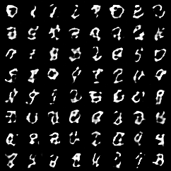
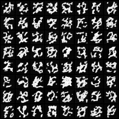
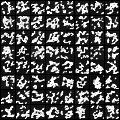
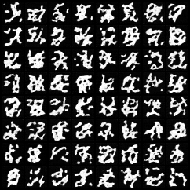
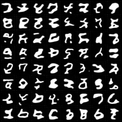
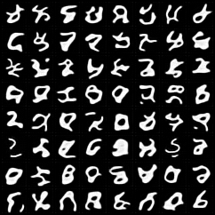
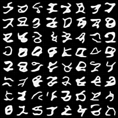

# DATA 37100 — Final Project Summary Report

**Author:** Chenqi Wang  
**Course:** DATA 37100
**Dataset:** MNIST  
**Date:** March 13, 2026

---
## Core Question

How do target parameterization (`eps` vs `x0`) and model capacity (`base_ch`) affect diffusion sample quality on MNIST?

## 1. Question and Motivation

In this project, I study how two design choices affect diffusion model performance on MNIST under very limited training. The main question is: when training is short, how much do the prediction target (eps vs x0) and model width (base_ch) change the final sample quality? I focus on this question because diffusion models can be sensitive to both the learning target and the model capacity, and I want to see which one matters more in a small, controlled setting. I use MNIST because it is simple, and easy to judge visually. Besides the diffusion experiments, I also include a GAN baseline for comparisons. My main controlled experiment is vary target and base_ch while keeping the other training settings fixed. This makes it easier to compare results and understand where the performance differences come from.

## 2. Methods

### Models used

- **Diffusion (DDPM-lite U-Net):** primary model family for the controlled experiment.
- **DCGAN:** secondary baseline to show a different generative paradigm under the same short-training budget.

### Dataset and fixed settings

All runs use MNIST. For the diffusion experiment, I fixed `T=200`, `beta1=1e-4`, `beta2=0.02`, learning rate `2e-4`, batch size `128`, seed `42`, and trained for exactly 1 epoch. The two controlled knobs were `target ∈ {eps, x0}` and `base_ch ∈ {32, 64, 128}`, for a total of six diffusion runs. The GAN baseline was trained for 1 epoch with `lr=2e-4`, `z_dim=128`, and `base_ch=64`.

### Evaluation

- **Qualitative evidence:**  sample grids for each run and denoising-step visualizations. Also the failures diagnoise.
- **Quantitative evidence:** per-run runtime and a simple pixel-space diversity proxy (average pairwise L2 distance across generated tiles).

## 3. Baseline Results Across Two Model Families

two figures below compares the two required baselines. After only 1 epoch, the GAN already generates somewhat recognizable digit-like samples. The diffusion baseline shown here (`target=eps`, `base_ch=64`) is still underfit: the denoised outputs contain digit-like hints, but many samples remain very noisy. This contrast is useful because it shows that short training does not produce the same failure between two family.

**GAN baseline (final samples):**

**Diffusion baseline (eps, ch=64, final samples):**

**Figure 1.** Baseline comparison: DCGAN (top) vs diffusion baseline with `T=200`, `target=eps`, `base_ch=64` (bottom).

The GAN baseline finished in **42.3 seconds** and its final grid shows some digit like samples. The diffusion baseline took **86.7 seconds**  and still looks underfit. 

## 4. Controlled Diffusion Experiment

Figure below shows the full 2×3 diffusion grid. The visual trend is strong. At every tested `base_ch`, the `x0` models produce more recognizable and coherent digits than the corresponding `eps` models. The gap is largest at low capacity: `eps/ch=32` mostly generates large white blobs with little digit structure, while `x0/ch=32` already produces digits that are very burry but still interpretable. As `base_ch` increases, both parameterizations improve, but `x0` remains visually stronger in this 1-epoch regime.

**eps parameterization:**

| base_ch = 32 | base_ch = 64 | base_ch = 128 |
|:---:|:---:|:---:|
|  |  |  |

**x0 parameterization:**

| base_ch = 32 | base_ch = 64 | base_ch = 128 |
|:---:|:---:|:---:|
|  |  |  |

**Figure 2.** Sample grids for the six diffusion runs (`target ∈ {eps, x0}`, `base_ch ∈ {32, 64, 128}`).

A likely explanation is that the two parameterizations place different learning burdens on the network. In the `eps` setting, the model predicts noise and the reverse process reconstructs the image from that prediction. Under short training and limited capacity, imperfect noise estimates may propagate through the 200-step reverse process and produce degraded outputs. In contrast, direct `x0` prediction may provide a more accessible target early in training, allowing rough digit structure to emerge before full convergence.

The runtime and diversity proxy support the visual interpretation, but only partially. Runtime increases sharply with `base_ch`, while the diversity proxy is informative only when read together with the sample grids.

| Target | `base_ch` | Runtime (s) | Diversity |
|---|---:|---:|---:|
| `eps` | 32  | 38.24  | 13.4493 |
| `eps` | 64  | 86.66  | 11.6158 |
| `eps` | 128 | 252.28 | 12.6904 |
| `x0`  | 32  | 38.05  | 11.2202 |
| `x0`  | 64  | 86.47  | 11.4975 |
| `x0`  | 128 | 250.10 | 12.2375 |

The most revealing row is `eps/ch=32`: it receives the highest diversity score (**13.4493**) even though it produces the worst-looking samples. This happens because random, unstructured outputs can be far apart in pixel space even when they are not meaningful generations. In contrast, `x0/ch=32` has lower diversity (**11.2202**) but far more recognizable digits. So the diversity proxy is not a quality metric by itself; it is mainly a sanity check for variation and can be misleading for underfit models.

## 5. Failure Modes and Limitations

### Failure Mode 1: `eps` at low capacity produces noisy blob-like outputs

The strongest failure appears in `eps/ch=32`, where the model outputs large white masses instead of digits. The corresponding `x0/ch=32` run does not look good but it already captures the idea of a digit. This makes low-capacity underfitting much harsher for `eps` than for `x0` in this setup. It may because in the eps parameterization, the network predicts the noise component and the reverse process reconstructs the image from that prediction. Under short training and limited capacity, errors in noise prediction may propagate through the 200-step reverse process, leading to visibly degraded samples. By contrast, the x0 parameterization directly predicts the clean image, which may provide a more accessible learning target in this underfitted regime: even an approximate x0 prediction can already produce digit-like structure, whereas approximate eps predictions may translate into noisier reconstructions.

### Failure Mode 2: the diversity proxy over-rewards bad noise

The pixel-space diversity proxy shows eps/ch=32 with the highest diversity (13.45), yet the sample grid reveals these are just random noise blobs — not meaningful diversity. Meanwhile, x0/ch=32 has lower diversity (11.22) but produces actual recognizable digits. The diversity proxy measures pairwise L2 distance in pixel space. Random, unstructured outputs are all different from each other (high L2), while recognizable digits share common structures (strokes, shapes) that reduce L2 distance. This metric cannot distinguish "diverse because noise" from "diverse because rich generation." This is a fundamental limitation of pixel-space diversity metrics.

### Failure Mode 3: GAN shows limited variety rather than blob failure

The GAN baseline already produces recognizable digits after 1 epoch, but some samples cluster around similar styles. Its loss curve also shows early imbalance: the discriminator drops quickly while the generator stays relatively high for much of training. This suggests that under short training, GAN tends to fail by limited coverage or partial mode concentration, whereas diffusion in this experiment fails more through noisy, unstable reconstructions.

### Limitations

- All diffusion runs were trained for only 1 epoch. The conclusions therefore describe a short-training regime, not fully converged behavior.
- The diversity proxy is intentionally lightweight and does not track perceptual quality. A stronger study would add FID or another distribution-level metric.

## 6. Conclusion

The results show a clear pattern under this short-training MNIST setting. Across all tested base_ch values, x0 produces more recognizable and structured digits than eps, while eps remains noisier and less stable, especially at low capacity. Increasing base_ch improves sample quality for both parameterizations, but it does not remove the gap between them within a 1-epoch budget. The strongest difference appears at ch=32, where eps largely fails but x0 already produces interpretable digits.

The eps/ch=32 result also helps explain why the diversity proxy needs to be interpreted carefully. Although it receives the highest diversity score, it produces the worst-looking samples, showing that pixel-space L2 distance can reward random, unstructured variation rather than meaningful generative diversity. This makes the metric useful only when it is read together with actual sample grids.

The comparison with the GAN baseline adds another useful perspective. After 1 epoch, the GAN already generates recognizable digits, although its sample variety still appears somewhat limited. The diffusion baseline is more about noisy, unstable reconstructions. Together, these results suggest that under limited training, both prediction target and model width matter for diffusion models, and x0 is the more robust choice in this setting. 
